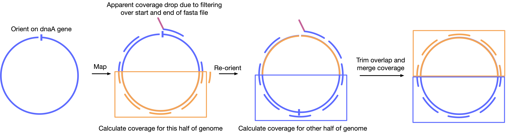

# Complete and validated genomes from a metagenome

Daniel J Giguere, Alexander T Bacheli

**EBI is currently unable to make the read files associated with the Project public due to technical issue. Raw reads are available to download [from this link](https://uwoca-my.sharepoint.com/:f:/g/personal/dgiguer_uwo_ca/EulzfHO0ytNFhN8C8hWCjkEBakNF_wlnIUMbCR8izXw2yw?e=iE2NZp) in the mean time.** 

This repository is intended to accompany the [pre-print](https://www.biorxiv.org/content/10.1101/2020.04.08.032540v1) by providing the code used, and an example for the circos plot visualizations. The main pipeline can be found in [validation-work-flow-final.sh](validation-work-flow-final.sh). Fasta files of the genomes are available [here](data/genomes)

### Orienting genomes on dnaA gene

We applied the following strategy to orient the genomes:

1. Annotate the genome using prokka.

2. Identify the start of the dnaA genes using prokka (using a grep "dnaA" command). If multiple dnaA genes exist, extract the first dnaA identified by prokka. 

3. Using a python script (orient.py), re-orient the genome so that the start of the dnaA gene correspond with the start of the genome. 

### Counting long read coverage at beginning and end of fasta reference

After filtering Nanopore reads by > 90% query coverage, apparent read coverage at the beginning and end of the reference genome will appear to decrease because `minimap2` will map a read only to the start **or** end of a fasta file, which causes apparent query coverage to be artifically low. Therefore we applied the following strategy:

1. Using the oriented genome, approximate the mid-point of the genome based on its length.

2. Make a re-oriented copy of the genome that begins at the halfway point of the oriented genome using `modify-genome.py`. 

3. Map long reads to both the original and re-oriented genomes, separately. 

4. To determine the long read coverage for the first and last quarters of the original genome, calculate the coverage in windows of 1000 bp of the second and third quarters of the re-oriented genome. Because the second and third quarters of the re-oriented genome are relatively far from the origin of the re-oriented genome, reads will not be mapped off the "edge" of the fasta file (assuming the read length is relatively small compared to genome size). Coverage of filtered reads can therefore be correctly calculated at the start of end of a fasta file.

5. To determine the long read coverage for the second and third quarters of the complete genome calculate the coverage of every 1000 bp of the second and third quarters of the original genome. 

6. Concatenate the coverage from each quarter of the genome together to get the complete genome coverage.

7. The final calculated coverage segment of the genome is assumed to be 1000 bp in length. Because most genomes are not an exact factor of 1000, a given genome likely includes the coverage of part of the start of the genome (refer to image below). To accruately determine the coverage of this end segment of the genome, trim the coverage to the correct length of the genome. 

### Generating genome plots using the circlize R package 

The R package `circlize` was used to generate each of the genome figure. An example script is available as [circos.md](circos.md) to reproduce the plots for one genome that requires the following as input:  

  - table of GC content, skew and culmulative skew calculated from `circlize_gc_information.R`
  - unfiltered Illumina coverage
  - filtered Illumina coverage
  - unfiltered nanopore coverage
  - filtered nanopore coverage
  - coding sequences (positive and negative strand in separate files)
  - location of tRNA and rRNA genes
  - cytoband file (required for length and genome name)

### Required Python Scripts

`validation-work-flow.sh` requires a number of scripts to run. These scripts are:
- __bed-file-orientation.py__: orienting the prokka annotations according to the start of the genome
- __cigar-parse.py__: filtering reads aligned to a genome
- __dot-plot.py__ for creating dot plots of segments of a genome and the flye re-assembled genome against the polished genome (also requires dot-plot.R)
- __extract-circularized-fasta.py__: extracting circularized genomes above a certain minimum size for anaylsis
- __modify-genome.py__: re-orienting a genome so that the start of the genome begins half way into the fasta sequence
- __modify-nanopore-bed.py__: calculating genome coverage from both the "forward-oriented" and "reverse-oriented" genomes
- __orient.py__: orienting the genome to start at the dnaA gene
- __table1.py__: creating the first summary table
- __table2.py__: creating the second summary table

